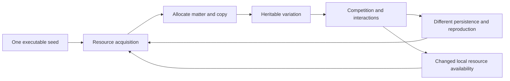
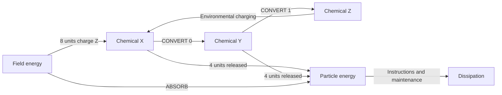
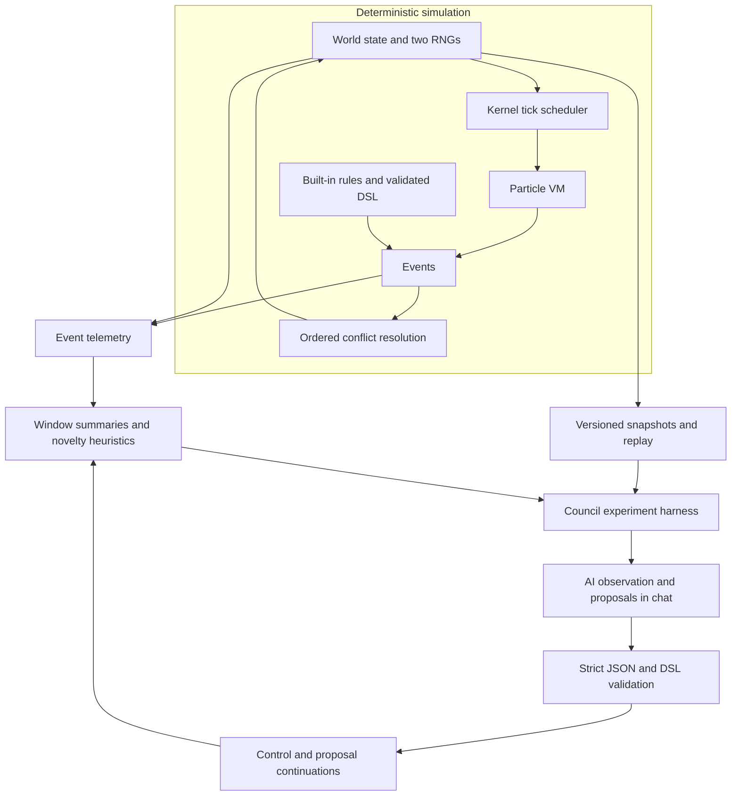
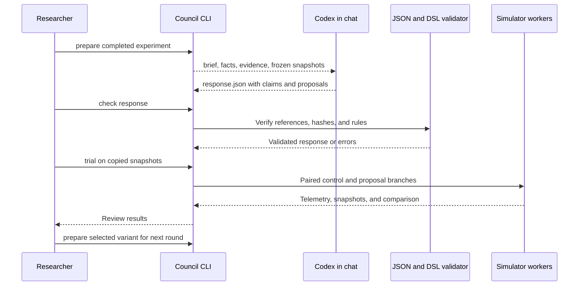

# Open-End

**A reproducible digital evolution laboratory where programs compete for physical resources and an external AI can propose new mechanisms for the world.**

Open-End explores a research question: can local Darwinian evolution, a changing environment, and occasional AI-proposed rule changes sustain adaptive novelty over long periods?

The current implementation combines a deterministic Go simulator, executable replicators, chemical ecology, event telemetry, stagnation heuristics, and a file-based AI experiment harness. Codex can act as the observer and proposal author directly in chat. An experimental NVIDIA Warp backend provides GPU physics execution.

[Quick start](#quick-start) · [Concept](#concept) · [Architecture](#architecture) · [AI workflow](#ai-observation-and-rule-proposals) · [Results](#what-the-experiments-show) · [Documentation](#documentation)

## Concept

A world begins with one working seed program on a two-dimensional grid. Reproduction spends energy and matter: programs allocate particles, copy code, and can also copy memory or transfer extra energy. Copying errors create heritable variants. Space, resources, operation costs, and interactions determine which variants persist and reproduce.

There is no explicit fitness function inside the world. Organisms are not assigned species, ecological roles, or objectives. The initial replicator does contain a working metabolism and copying routine: this project currently studies evolution after replication exists, rather than the origin of life from random matter.



The longer-term idea is to expand the set of mechanisms evolution can use. An external AI reads evidence, formulates hypotheses, and proposes a bounded change to local physics. The simulator tests that proposal in independent continuations of the same source world. New mechanisms may be adopted, ignored, or harmful.

**Open-ended evolution is the research goal, not an established result.** More genome hashes, larger structures, and higher population counts are not sufficient evidence. The important questions are whether new behaviors persist, have causal effects, create opportunities for further adaptations, and eventually support new levels of organization.

## Current capabilities

| Area | Implemented | Current boundary |
|---|---|---|
| Digital physics | Toroidal grid, finite matter, integer energy, local interactions | Fixed basic world representation |
| Replicators | Executable code, memory, copying, mutation, death | A working seed is supplied |
| Ecology | X/Y/Z chemistry, transport, energy taking, bonds | Obligatory metabolic interdependence is not established |
| Rule DSL | Validated reactions, bytecode budgets, versions, scheduled changes, rollback | Local resource reactions only |
| Observation | Event telemetry, window summaries, interaction graphs | Some structural measures are sampled |
| Novelty detection | Diversity/structure plateaus and behavioral signatures | Local heuristics, not adaptive-value proof |
| AI workflow | Evidence dossiers, referenced claims, rule proposals, paired trials | AI participates through chat/files |
| Branching worlds | Persistent ancestry, multiple selected cohorts, repeated continuations, interactive HTML explorer | Explicit research scheduling |
| Novelty archive | Immutable decisions, Pareto tips, protected behavior cells, recommended selections | Measured proxies; causal complexity and hierarchy unavailable |
| Evolvability | Inherited copy rates/operators, local recombination, proofreading, memory transmission, policy inspector | Finite policy repertoire; persistent strategy diversity remains unproven |
| GPU execution | Warp physics with exact differential checks | No full genome/origin history on GPU |

Stages 0–5 provide the research foundation. Stages 6–7 work through the current reaction DSL and chat-based protocol. Stage 8 preserves multiple directions across generations with an offline branch explorer. Stage 9 adds a novelty archive and Pareto selection using measured proxies. Stage 10 implements inherited copying strategies; their persistent diversity remains an open experimental criterion. Stage 11 concerns environmental coevolution.

## Quick start

Requirements: **Go 1.26+**. The Go code uses only the standard library. Batch scripts require **PowerShell 7+**. Run all commands from the repository root.

Run a small ecology world:

```powershell
go run ./cmd/sim -width 32 -height 32 -seed 1 -ecology -matter-diffusion 4 -chemical-diffusion 4 -ticks 20000 -every 1000 -metrics data/run.jsonl -save data/world.json
```

Explain its recent history and detect possible stagnation:

```powershell
go run ./cmd/summarize -input data/run.jsonl -window 10000 -detect
go run ./cmd/summarize -input data/run.jsonl -window 10000 -detect -format json
```

Continue from the saved state:

```powershell
go run ./cmd/sim -load data/world.json -ticks 10000 -every 1000 -metrics data/continued.jsonl -save data/continued.json
```

`-ticks` means additional ticks. Loading restores configuration and both RNG states; world parameters cannot be overridden with `-load`. JSONL paths and experiment directories must be new. Snapshot destinations may be replaced by the simulator's temporary-file/rename write. Run output under `data/` is ignored by Git.

Without flags, `cmd/sim` uses the original 256×256 control configuration. Use `go run ./cmd/sim -h` for all options.

## How the world works

Each grid cell has four neighbors and can hold one particle. A particle has energy, a bounded program, eight memory cells, and execution state. The VM issues one instruction per particle per tick. Instruction attempts and maintenance consume energy; particles without energy decay and return their matter to the cell.

The initial seed replicates through a sequence of physical operations:

```text
ALLOCATE → COPYMEM → COPY → TRANSFER
```

`ALLOCATE` consumes neighboring matter and transfers a 12-unit energy reserve. `COPYMEM` and `COPY` can mutate the inherited state. The target must remain adjacent. A newly created particle first executes on the next tick.

Ecology adds three chemical states with energy potentials X=8, Y=4, and Z=0. The baseline energy cycle is:



The arrows describe resource accounting; they do not assign ecological roles. Chemical transport makes products available to neighboring cells. Programs may also move, choose targets, transfer or take energy, form bonds, and unbind.

The implementation checks these resource identities:

```text
field energy + particle energy + 8×X + 4×Y
    = initial energy + inflow − dissipation

field matter + particle count = initial matter
X + Y + Z = initial chemical amount
```

See the [simulator reference](docs/reference.md) for all 17 instructions, costs, defaults, inheritance semantics, and resource constraints.

## Architecture

The execution kernel owns deterministic scheduling and state transitions. The current mutable DSL controls local resource reactions. Observation and AI interpretation sit outside the simulated world.



A tick introduces energy, orders particles by ID with a cyclic tick-dependent offset, gathers VM events, resolves conflicts while rechecking resources, and charges maintenance/decay. SENSE captures the value observed before event application. Field transport has its own serialized random stream, separate from mutations.

| Component | Responsibility |
|---|---|
| `internal/world` | State, configuration, and invariants |
| `internal/kernel` | Tick order, snapshots, replay, and rule installation |
| `internal/vm`, `internal/evolution` | Instructions, copying errors, and inheritance |
| `internal/rules`, `internal/dsl` | Physical effects and bounded reaction programs |
| `internal/observer` | Telemetry, summaries, and stagnation detection |
| `internal/experiment`, `cmd/assay` | Genome isolation and controlled mixtures |
| `internal/council`, `cmd/council` | Evidence exchange, proposal validation, and trials |
| `cmd/sim`, `cmd/analyze`, `cmd/summarize` | Run, analyze persistence, and explain history |
| `warp-sim`, `cmd/warp-reference` | Experimental GPU backend and Go parity reference |

Physical snapshots include the kernel and rule versions. Format 2 represents legacy copying without DSL state; format 3 includes DSL modules, history, queued changes, and usage counters. Format 4 adds encoded copying policies and their ledger, with or without DSL state. Incompatible snapshots are rejected. A rule rollback changes the rules; a snapshot restore returns the entire physical state.

## AI observation and rule proposals

The current AI interface is a file protocol. Codex reads a prepared dossier, writes observations and hypotheses with evidence references, and proposes complete DSL modules with a mechanism, prediction, and risk. No API key is needed.



Create a 16-world experiment and prepare its dossier:

```powershell
./scripts/experiments.ps1 -Workers 16 -Seeds (1..8) -Cases ecology,ecology-no-mutation -Ticks 100000 -Every 1000 -OutputDirectory data/batch
go run ./cmd/council prepare -input data/batch -out data/round -window 50000
```

Ask Codex to read `data/round/brief.md` and complete `data/round/response.json`. Then validate and test:

```powershell
go run ./cmd/council check -round data/round
go run ./cmd/council trial -round data/round -out data/trial -ticks 20000 -every 1000 -window 10000 -workers 16
```

Results include `comparison.md`, `results.json`, per-branch JSONL, and final snapshots. Prepare another discussion round from a selected variant:

```powershell
go run ./cmd/council prepare -input data/trial -variant control -out data/next-round -window 10000
```

A valid reference confirms where evidence came from; it does not prove the meaning of an AI claim. A valid DSL module satisfies execution and resource constraints; it does not establish that the change benefits evolution. Both questions remain part of experimental review.

The current mutation generator emits reaction IDs 0 and 1. The proposal harness rejects a structural extension that is reachable only through new IDs. Other operations, arbitrary new fields, and ontology changes are future work. See the [complete council protocol](docs/council.md).

## Observation and experiment discipline

For experiments spanning several rounds, use the [branching-world harness](docs/branching.md):

```powershell
go run ./cmd/council tree init -input data/batch -out data/tree -window 50000
go run ./cmd/council tree grow -tree data/tree -ticks 20000 -every 1000 -window 10000 -workers 16
go run ./cmd/council tree export -tree data/tree
```

Open `data/tree/index.html` to inspect ancestry, select several cohorts, compare worlds by case and seed, and prepare continuation commands. Add `-proposals` to growth after authoring a response in each selected node's dossier. Every proposal receives a paired control, and every child remains available for future continuation. The HTML report is offline; it prepares explicit CLI commands and never launches work on its own.

- **Measure events and state separately.** Copying, deaths, transfers, and reaction usage are recorded across every tick; population and structural extrema describe sampled frames.
- **Distinguish genomes from inherited state.** `genomes` counts code variants. `lineages` includes initial inherited memory, so multiple lineages can exist without code mutation.
- **Treat novelty conservatively.** New genome hashes do not establish new behavior. The detector checks plateaus, repeated behavioral signatures, and persistent changes across four blocks.
- **Keep comparable starts.** A trial's control and proposal begin from the same frozen state and initial RNGs. Subsequent events diverge with the states.
- **Retain provenance.** Request/response hashes, snapshots, module versions, and telemetry identities make experiments inspectable and reproducible.

Detector statuses are `stagnating`, `developing`, `mixed`, `insufficient_history`, `extinct`, and `rule_change`. They describe local evidence within one world window. They are not an automatic ranking of different rule sets.

Batch simulation uses up to 16 independent processes with `GOMAXPROCS=1` each. Council trials use 16 worker goroutines with `GOMAXPROCS=16`. Parallelism is across worlds; event ordering within each world remains deterministic.

## What the experiments show

The [novelty archive](docs/archive.md) recommends non-dominated tips and representatives of otherwise uncovered behavior cells. Its decisions are versioned and preserve their evidence and policy settings:

```powershell
go run ./cmd/council tree archive -tree data/tree -apply
go run ./cmd/council tree grow -tree data/tree -ticks 20000 -every 1000 -window 10000 -workers 16
go run ./cmd/council tree archive -tree data/tree -apply
go run ./cmd/council tree export -tree data/tree
```

Archive selection uses novelty distance, effective genome diversity, bonded structural scale, and persistence of copying. It does not assign a single fitness score. Hierarchy, causal structure, and new information processing remain unmeasured. Applying an archive decision changes the selected branches; simulation starts only with `grow`.

| Experiment | Recorded finding | Interpretation |
|---|---|---|
| [Baseline replicators](experiments/baseline/RESULTS.md) | Heritable code variants and exact replay | A working foundation for evolutionary experiments |
| [Extended ecology](experiments/ecology/parallel-300k/REPORT.md) | 48 runs × 300,000 ticks; distinct behavior groups in 15/16 ordinary ecology worlds | Persistent diversity, without proof of obligatory exchange |
| [Isolated lineages](experiments/ecology/isolation/REPORT.md) | Both selected lineages reproduce alone | Obligatory interdependence was not detected for that pair |
| [Stagnation detector](experiments/novelty/REPORT.md) | 7/8 no-mutation controls stagnate over the final 50,000-tick window | Useful heuristics with window sensitivity |
| [First AI proposal](experiments/council/REPORT.md) | 32 continuations × 20,000 ticks in 17.05 s; mean mutation-world diversity 7.849 → 6.644 | Keep the patch as an experiment, not an accepted improvement |
| [Branching generations](experiments/branching/REPORT.md) | 5 cohorts, 80 stored world states, two retained directions over two generations | Branch history and independent continuation work; no automatic winner |
| [Novelty archive](experiments/archive/REPORT.md) | Both recommended directions continued; 7 cohorts and two immutable archive decisions | Tradeoffs and rare-cell retention work as research heuristics |

These are recorded results for specific configurations and horizons, not general performance or OEE guarantees.

## Experimental GPU backend

Warp implements all 17 VM opcodes, legacy mutations, transport, bonds, both RNGs, and scheduled DSL changes. Differential tests compare physical state exactly with Go. Genome/origin histories and complete observer work remain outside the GPU implementation; its output is a physical report, not a resumable Go snapshot. Stage 10's encoded copying models currently run in Go and are explicitly rejected by Warp.

In the [recorded RTX 5070 / Ryzen 7 5700X benchmark](experiments/warp/REPORT.md), 32×32 worlds ran for 1000 measured ticks each:

| Simultaneous worlds | Go, 16 workers | Warm Warp compute | Interpretation |
|---:|---:|---:|---|
| 16 | 0.33 s | 2.31 s | Go is faster |
| 256 | 4.66 s | 2.79 s | Warp compute is 1.67× faster |

Preparation and state extraction brought the 256-world GPU run to about 19 seconds. Go remains the default for current small batches. See [Warp setup, commands, and limitations](warp-sim/README.md).

## Roadmap

| Stages | Direction |
|---|---|
| 0–5 | Deterministic world, replication, ecology, reaction DSL, telemetry, novelty heuristics |
| 6–7 | AI observation and rule proposals; currently implemented through chat and files |
| 8 | Implemented: branching experiments, retained cohorts, and an offline explorer |
| 9 | Implemented: novelty archive, Pareto selection on measured proxies, and behavior-cell retention |
| 10 | Implemented mechanics: inherited copying strategies; persistent diversity remains unproven |
| 11–14 | Environmental coevolution, collective entities, causal analysis |
| 15–18 | Symbols, cultural inheritance, persistent artifacts, and technology-like construction |
| 19–21 | Internal VMs, recursive evolution, and long-horizon OEE experiments |

Later stages are research directions with acceptance criteria, not promises that these phenomena will emerge. The [full research plan](open_ended_evolution_ai_world_plan.md) preserves both the numbered roadmap and the later refinements to the research philosophy.

## Verification

```powershell
go test ./...
go vet ./...
go build ./...
go test ./internal/kernel -run '^$' -bench BenchmarkStep -benchmem
```

The test suite covers deterministic replay, resource conservation, mutation and VM behavior, DSL validation, telemetry integrity, detector edge cases, evidence provenance, and paired-trial reproducibility. Warp has a separate differential suite documented in its README.

## Documentation

- [Simulator and experiment reference](docs/reference.md): instructions, costs, snapshots, DSL, telemetry, detector thresholds, and batch commands.
- [Council interface](docs/council.md): prepare, check, trial, and next-round workflows.
- [Branching worlds](docs/branching.md): tree storage, multiple selections, repeated growth, and the interactive explorer.
- [Novelty archive](docs/archive.md): descriptors, admission filters, Pareto comparisons, protected cells, and selection commands.
- [Evolvability](docs/evolvability.md): inherited copy policies, fixed controls, telemetry, and the policy inspector; [24-world experiment](experiments/evolvability/REPORT.md).
- [Research plan](open_ended_evolution_ai_world_plan.md): full concept and staged research program.
- [Warp backend](warp-sim/README.md): setup, execution, benchmarks, and parity checks.
- [Ecology results](experiments/ecology/RESULTS.md), [DSL validation](experiments/dsl/SMOKE.md), and [telemetry validation](experiments/telemetry/REPORT.md).

Documentation and human-readable archived reports are in English. Historical JSON experiment records retain their original contents, including language-bearing fields, to preserve recorded hashes and provenance. Runtime-generated text follows the current CLI implementation.
