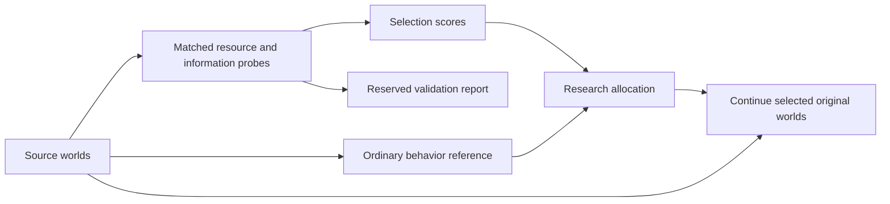

# Adaptive capability and research allocation

The research priority is sustained evolution, functional diversity, and increasing adaptive capability. Multicellularity, mutual exchange, symbols, and higher-level individuality are possible routes, not prerequisites. An individual executable particle can improve without acquiring any of these structures.

`cmd/adapt-assay` implements a first **adaptive capability proxy**, followed by ordinary evolution of selected worlds. This is an external experiment scheduler. No intelligence attribute, fitness score, or reward is added to particles or physical rules. UI work remains deferred.

## What version 1 measures

Each source world receives four resource challenges, each in three matched arms. Two challenges determine selection; two are reserved for validation in this round. All arms start with the same source particles, programs, fields, ancestry and RNGs before the stated interventions.

| Challenge | Resource change | Used for |
|---|---|---|
| `dim` | Inflow becomes `floor(original / 2)` | Selection |
| `mix` | Free cell energy and chemistry shift horizontally by half the grid width | Selection |
| `pulse` | Inflow is zero for the first third of the probe, then restored | Reserved validation |
| `mix-dim` | Free energy and chemistry shift by one third width and half height; inflow becomes `floor(3*original / 4)` | Reserved validation |

Permutations preserve energy and chemical totals. Particles, matter, terrain and inscriptions remain in place. The three arms are:

- **Intact:** ordinary execution under the resource challenge.
- **Frozen perception:** each particle receives the first value it observes for each external SENSE channel or LISTEN direction throughout the probe. New particles establish their own first observation. Self-energy sensing stays live, so the ancestor's basic copying threshold is not counted as an advanced external-information capability. Instruction costs are unchanged.
- **Memory reset:** erase current memory once at probe start, then permit normal reading, writing and transmission. Code, inherited-memory provenance, IP, flag and target remain unchanged. This measures sensitivity to prior stored state; it does not disable all working memory throughout execution.

Performance is the average capped executable population retention:

```text
R = mean over probe ticks of min(1, executable(t) / executable_at_start)
```

New descendants contribute; this is not original-member survival. Growth beyond the starting executable population is capped. This metric favors maintenance of executable activity under challenge, and is not a complete measure of task performance.

For each split, average intact retention and the two signed contrasts across its two challenges:

```text
robustness = mean(R_intact)
perception_benefit = mean(R_intact - R_frozen_perception)
memory_benefit = mean(R_intact - R_memory_reset)
information_benefit = (max(0, perception_benefit) + max(0, memory_benefit)) / 2
adaptive_proxy = 100 * robustness * information_benefit
```

The score is zero unless at least one intact arm copies and mean information benefit reaches the configurable threshold, **0.01 by default**. The threshold is a practical effect-size gate, not a significance test. Negative contrasts remain visible in the report. Clamping occurs after averaging each signed contrast, not independently for favorable challenges. The weights, threshold and challenge definitions are explicit versioned heuristics.

## Diversity and selection

An additional ordinary continuation of one probe-length measures recent activity. Live genomes are grouped by observed rates of movement, copying, absorption, transfer, taking, binding, and conversion. Rates per 1,000 executed instructions are mapped to `round(2*log2(1+rate))`. The effective number of resulting behavior profiles is `exp(Shannon entropy)`, weighted by live population among genomes that executed instructions in this reference interval. The world's descriptor is the population-weighted mean of the seven unrounded logarithmic rates.

These profiles approximate functional diversity. They omit signal usage, memory behavior, timing, topology and many possible functions. They are broader than counting genome hashes, but are not a complete behavior taxonomy. Program size contributes no direct bonus.

With four continuation slots:

1. At most two go to the highest **positive selection-split** adaptive scores.
2. One is reserved for deterministic exploration, using a separate SHA-256 ranking of source hashes and a selection seed.
3. Remaining slots maximize behavioral spread. With no selected reference, start with highest functional diversity; then choose the largest nearest-neighbor descriptor distance. Ties use source hashes.

If all adaptive scores are zero, no world is labeled a superior adaptive candidate. The allocation falls back to three diversity slots and one exploration slot. Reserved validation scores are recorded but never consulted by selection. Original snapshots, including unselected alternatives, remain available. The selected worlds continue from their **unmodified sources**, not from challenged or impaired endpoints.



## Running and reproducibility

```powershell
go run ./cmd/adapt-assay -input data/symbols-stage15 -case symbols -out data/my-adaptivity-round -workers 16 -ticks 1000 -select 4 -continue-ticks 20000 -every 1000
go run ./cmd/council prepare -input data/my-adaptivity-round -out data/my-adaptivity-dossier -window 20000
```

Sources must belong to one case, have the same horizon and physical configuration except seed, contain executable particles, and have no scheduled rule changes. The command checks source snapshot hashes and creates a new output directory. It records `evaluation.json`, a manifest, and ordinary continuation snapshots/JSONL plus `summary.json` compatible with council and subsequent batch tooling.

Each of the 12 probes records its source, post-intervention initial, and final world hashes; the full per-tick executable count; retention; copies; changed sensory values; and reset-particle count. Frozen observations are external protocol state, so counterfactual endpoints are **not** published as normal resumable snapshots. Reproduce them through the assay. The eight-memory-cell reset preserves the separate `initial_memory` provenance field.

The [first recorded round](../experiments/adaptivity/REPORT.md) includes an independent score/selection verifier. Tests cover matched controls, deterministic replay, one-versus-sixteen workers, intervention reachability, source integrity, absence of validation leakage, and exact ordinary continuation from selected source snapshots.

## What it does not establish

This is an initial measurement of world-level information benefits, not general intelligence, learning efficiency or consciousness. Population retention can be achieved by simple robust strategies. Memory reset also disturbs scratch registers at the current instruction phase; its effects can reflect implementation fragility or copying state rather than useful experience. Longer probes allow mutation and selection, so effects need not belong to one organism's learning process. Sparse sensory exposure limits the power of the test.

The score includes explicit researcher choices and may be exploited by evolution. Keeping diversity and exploration limits concentration on this proxy; it does not eliminate that risk. Validation probes are reserved for this selection round only. Reusing the same suite for repeated development makes them familiar to the research process; future rounds should introduce additional withheld challenges before making transfer claims.

The distinction between skill and efficient acquisition/generalization motivates treating this as a provisional proxy rather than an intelligence measure ([Chollet, 2019](https://arxiv.org/abs/1911.01547)). Combining quality with diversity has an established evolutionary-search rationale ([Pugh, Soros and Stanley, 2016](https://www.frontiersin.org/journals/robotics-and-ai/articles/10.3389/frobt.2016.00040/full)). The particular assay, formula and selection budget here are project-specific and are not validated by those papers.

Next extensions should create measurable opportunities for useful memory, prediction and adaptation to changing contexts, then test transfer and acquisition efficiency. Code growth, communication and collective organization remain mechanisms to investigate rather than mandatory advancement gates.
