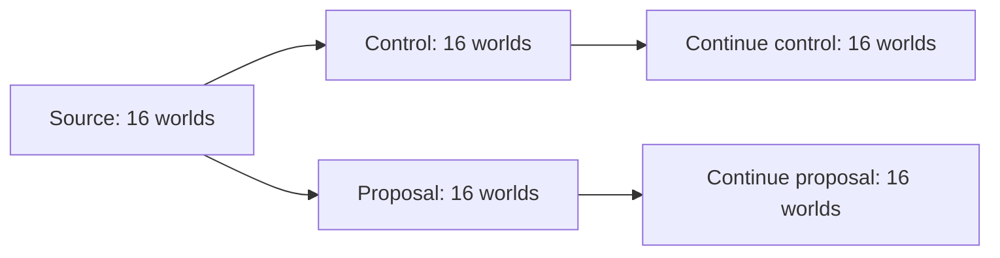

# Branching worlds (Stage 8)

The tree harness preserves multiple evolutionary directions across generations. A node is a **cohort** of worlds, identified by case and seed, under one rule variant. Children retain the exact parent snapshot identity, the accepted rule experiment, and their own frozen snapshots and evidence.

Selection controls which cohorts receive more computation; deselecting a branch never deletes it or declares it unsuccessful. Select manually or apply the [Stage 9 novelty archive and Pareto policy](archive.md), which preserves several directions using measured objectives and behavior cells.

[Stage 10](evolvability.md) worlds retain their inherited copying policies, counters, and donor provenance through tree continuation. Their evidence panels include an offline genome/policy inspector with world, code/memory, and persistence filters. Policy counts are also included in council facts; archive context matching includes the copy-model configuration.

## Workflow

Run commands from the repository root. The Go implementation uses the standard library and defaults to 16 workers.

```powershell
# Import a completed experiment into a new, self-contained tree.
go run ./cmd/council tree init -input data/novelty-stage5 -out data/my-tree -window 50000

# Inspect the source and export an offline interactive report.
go run ./cmd/council tree show -tree data/my-tree
go run ./cmd/council tree export -tree data/my-tree
```

Open `data/my-tree/index.html` in a browser. The report provides:

- an ancestry diagram with selectable branch cards;
- comparisons by case and seed, including actual observation windows;
- population, effective genome diversity, final structure size, and copying rate;
- detector status, evidence locations, and request identities;
- a command builder with tick, reporting, window, and worker controls;
- completed, failed, and unfinished run history.

The report is self-contained and requires no server or external assets. Browser selections prepare commands; they do not modify the tree or start simulations. Run the commands in PowerShell and export again to refresh the report.

## Create alternative rule branches

Every node contains a council dossier in `nodes/<id>/round/`. Ask Codex to read its `brief.md` and write `response.json` using the existing [council protocol](council.md).

```powershell
go run ./cmd/council check -round data/my-tree/nodes/b000001/round
go run ./cmd/council tree grow -tree data/my-tree -proposals -ticks 20000 -every 1000 -window 10000 -workers 16
```

Proposal mode requires a valid response with at least one proposal for **every selected parent**. The harness validates all selected inputs before computing anything. Each parent produces a control cohort plus one cohort per proposal; every cohort retains all source cases and seeds.

Responses are bound to their own request and base rules. A response from one branch cannot be reused for a different request. No model is invoked automatically.



## Continue several directions

By default, a successful generation selects all its children. Continue those directions without proposing another rule change:

```powershell
go run ./cmd/council tree grow -tree data/my-tree -ticks 20000 -every 1000 -window 10000 -workers 16
```

To save a different selection, including older branches:

```powershell
go run ./cmd/council tree select -tree data/my-tree -branches b000002,b000003
```

To override the saved selection for one launch:

```powershell
go run ./cmd/council tree grow -tree data/my-tree -branches b000002,b000003 -ticks 20000 -every 1000 -window 10000 -workers 16
```

Branch IDs are assigned locally; inspect `tree show` rather than assuming IDs from an example. Following success, the newly created children become the saved selection.

`-ticks` is the additional duration per world. The analysis window must be positive and no greater than the run duration. Worker count is 1–256, default 16. Parent cohorts execute sequentially; within each cohort the existing council worker pool parallelizes independent worlds. This bounds total concurrency to the chosen worker count. It does not parallelize event resolution inside one world.

A continuation named `control` preserves **its immediate parent's rules**, which may already include an earlier proposal. It does not necessarily revert to the original built-in rules.

## Storage and provenance

```text
my-tree/
  tree.json                     Format/version and initialization gate
  selection.json                Saved set of branch IDs
  index.html                    Derived offline report
  nodes/
    b000001/
      node.json                 Parent, generation, variant, metrics, request ID
      round/                    Frozen council request, evidence, snapshots
        brief.md
        request.json
        response.template.json
        response.json           Optional authored proposal response
        wNNN.evidence.json
        wNNN.snapshot.json
  runs/
    r000001/
      run.json                  Parents, published children, options, status
      b000001/                  Paired council trial and complete telemetry
        manifest.json
        request.json
        response.json           Present for proposal trials only
        results.json
        comparison.md
        *.jsonl
        *.snapshot.json
```

Initialization copies the source snapshots and evidence. The original experiment is no longer needed to continue the tree. Each child receives a new dossier, so it can be reviewed or extended through the same council interface.

Reading the tree checks request identities, evidence hashes, cached comparison metrics, parent/child generations, and trial source/final hashes. Before growth, council additionally loads and validates frozen physical snapshots. These checks detect changed or mixed artifacts; they are not author signatures.

Nodes are published only after their round is complete. Selection and run metadata use temporary-file replacement. An exclusive `.write.lock` prevents concurrent writers. Previously published nodes remain available when a later cohort fails; selection changes only after the requested generation succeeds.

A failed launch records `failed` and its error. A process killed before cleanup can leave a `running` record and the lock file. Confirm that the recorded process has stopped before manually removing **that tree's** `.write.lock`. Retry from the intact parent with a new run ID. Incomplete directories are retained for diagnosis; there is no mid-tick resume or automatic replay of partial work.

## Interpretation and boundaries

Compare the same cases and seeds, and check the actual windows. Copy counts are shown per 1000 ticks in the report to make duration explicit. Mean diversity on cards is descriptive and can mix experimental cases; use the per-case table for substantive conclusions.

The harness records diversity, reproduction, structures, and local novelty-detector status. It does not infer niche count, obligate cooperation, adaptive value, or a universal ranking across physical rule sets. Multiple retained directions are the Stage 8 criterion. The [Stage 9 archive](archive.md) now provides explicit selection heuristics and an auditable recommendation set; scientific interpretation remains a research judgment.

See the [recorded Stage 8 validation](../experiments/branching/REPORT.md).
