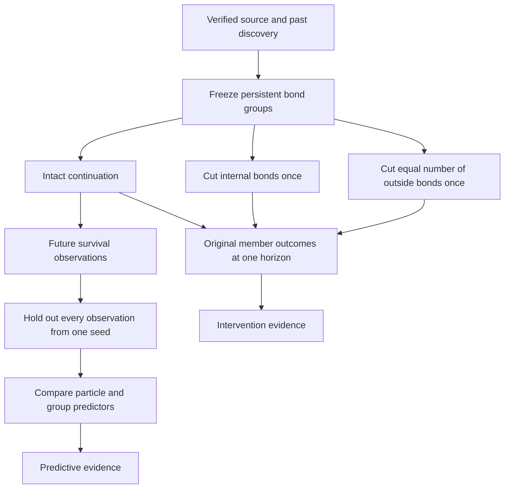

# Predictive and causal group analysis (Stage 14)

`cmd/causal` tests two different questions: whether a proposed group description predicts future survival better than limited particle descriptions, and whether its internal bonds causally affect its members under a specified intervention. Neither result automatically establishes a new individual or causal emergence.

The [first experiment](../experiments/causal/REPORT.md) uses the persistent bond candidates selected in Stage 13. It found survival effects of local bond removal, but no predictive advantage for the macro model over the particle model. Physical rules, VM instructions, snapshots, and the UI are unchanged.

## Run

```powershell
go run ./cmd/causal -input data/entities-stage13-verified -snapshots data/collectives-stage12 -out data/causal-analysis -workers 16 -horizon 1000 -blocks 5 -permutations 3 -ridge 0.01
```

The input must be a completed discovery batch. `-snapshots` supplies the physical snapshots matching its final hashes. Only intact worlds are used: sibling intervention arms are not treated as independent training or test worlds. The command verifies discovery-file hashes, source hashes, ticks, coded membership, and the selected physical components before creating a new output directory.

The selected targets are fully programmed bond components flagged persistent at the final discovery checkpoint. Components must be complete, connected, and disjoint. No future survival or intervention outcome enters selection. At least three seeds with selected groups are required for model evaluation; worlds without selected groups produce baseline continuations but no forecast observations.

`-workers 16` uses independent world continuations and GOMAXPROCS=16. World RNG states are cloned exactly. All randomized analysis choices use SHA-256 rankings derived from source identity, group/partition identity, and particle or edge IDs; analysis never draws from the physical RNGs.

## Experimental structure



The two analyses use the same initial targets but answer different questions. Prediction fits statistical descriptions to intact trajectories. Interventions create alternative physical histories from the same initial state.

## Forecast target and controls

Targets retain their original particle IDs throughout the baseline continuation. At each forecast interval, the predictor observes the still-alive coded members. A sample is eligible when at least two remain. Its target is the fraction of those members alive at the next checkpoint. Newborn descendants never replace dead members in this target. Eligibility depends only on the prediction-time state; groups that later shrink below two disappear from subsequent forecast samples.

Random controls permute the union of original target members into groups with the same initial sizes as the real groups. Each partition uses every pool member exactly once. This preserves the initial particle-feature marginals while changing grouping. Three deterministic permutations are used by default. Matching is at selection time: subsequent deaths can produce different eligible sample counts and sizes. Small pools may reproduce an original group exactly; this is reported in the experiment evidence, not forcibly prevented.

These random groups are alternative descriptions, not physical interventions. Their future survival fractions are different targets from the real groups. Lower raw error on a random partition can reflect averaging or different target variance; it is not proof that the random partition is a better entity. Compare model differences within the same partition and inspect variability across seeds.

## Predictors and fitting

| Model | Input and prediction |
|---|---|
| `persistence` | Predict that all currently alive members survive: fraction 1 |
| `constant` | Training-seed-balanced mean group survival fraction |
| `micro` | Predict survival separately for each particle from 12 local features, then average clipped predictions |
| `macro` | Predict the group survival fraction from 19 aggregate/context features |
| `micro-context` | Predict each particle from its local features plus the same 19 group features, then average clipped predictions |

The 12 local features are energy/capacity, age/(age+1000), code length/max code, local field energy/capacity, matter/(matter+16), each of X/Y/Z divided by itself plus 16, terrain/8, signal/64, bond degree/4, and occupied neighboring cells/4. These are fixed transforms, not normalization fitted using evaluation data.

The macro features contain the mean of each local feature plus size/(size+8), normalized energy variance, minimum normalized energy, dominant-genome fraction, internal bonds/(2×size), external bonds/(4×size), and mean pairwise toroidal Manhattan distance normalized by half-width plus half-height. Micro-context has 31 features. The intercept is additional in each fitted model.

Ridge least squares minimizes weighted squared error plus `ridge` times the squared non-intercept coefficients. The intercept is unpenalized. The default coefficient 0.01 is fixed; the command does not search hyperparameters on test outcomes. Predictions are clipped to [0,1]. These are limited model families, not exhaustive descriptions of the underlying state: complete programs, memory, and RNG state are not included in the micro predictor. Macro features also provide relational information absent from the local baseline; micro-context is an explicit check of that distinction.

Every evaluation fold holds out an entire seed and all its groups and intervals. Fitting uses only the other eligible seeds. Each training seed receives equal total weight; eligible groups/intervals within that seed share that weight. Particle models divide each group/interval weight across its members. Each partition is fitted separately with the same feature definitions, regularization, and target rule.

The primary reported loss is mean squared error of the predicted survival fraction. Mean absolute error is also reported and can favor a different predictor. Losses are first averaged within each held-out seed, then averaged equally across seeds. Observation counts remain available but are not treated as independent replicate counts. The procedure tests generalization to an unseen seed; it is not a chronological deployment evaluation, because training may use later intervals from other seeds.

## Local intervention and outside control

For each selected real group, the command clones the original source into two alternative worlds:

1. `local-cut` removes every initial bond whose two endpoints belong to the group.
2. `outside-cut` removes the same number of initial bonds with both endpoints outside the group, chosen by the independent analysis ranking.

The intact baseline supplies the matched control at exactly one horizon. A cut is a one-time experimental intervention. Subsequent ordinary BIND instructions remain enabled and can restore bonds; this differs from Stage 12's global persistent bond ablation. Removing bonds neither consumes nor refunds energy or matter. Cells, particles, code, memory, both RNGs, and all counters are initially unchanged apart from the listed relations.

If too few outside bonds exist, the outside control is explicitly unavailable. It is not replaced with a smaller cut or a fabricated zero effect. Outside cuts control the number of removed links, but do not match spatial locations, endpoint programs, or the detailed resource environment. They are mechanism controls, not perfect matched counterfactuals for all covariates.

Outcomes count survival of original target members, copies produced by those original members, TRANSFER energy between original members, and bonds between them at the endpoint. Descendants are not substituted into survival. Reported survival contrasts are local minus intact, outside minus intact, and local minus outside where both treatments exist. Negative local-minus-intact values mean the intervention reduced survival over the specified horizon.

Experiments on different target groups within a seed share a source world. Their outcomes are dependent, even though continuations execute independently. Per-seed descriptive effects and matched availability must accompany pooled group counts. A survival effect of bonds does not establish a group reproductive cycle, autonomous information processing, or a more predictive macro description.

## Artifacts and validation

| File | Contents |
|---|---|
| `manifest.json` | Inputs, configuration, task completion, eligible seeds, selected groups, sample count, and measured time |
| `index.json` | Source/discovery/control hashes, feature names, and hashes of baseline, intervention, and prediction artifacts |
| `seed-N-baseline.json` | Frozen real/random groups, prediction-time features, future labels, control outcomes, and continuation hashes |
| Per-group cut JSON | Exact removed bonds, source/initial/final hashes, outcome, or explicit unavailability |
| `prediction.json` | Training seeds per fold, individual group predictions, fold losses, and equally weighted seed means |
| `interventions.json` | Matched control/local/outside outcomes and survival differences |

There is one scheduled outside-cut task even when it proves unavailable; manifest task count is therefore distinct from the number of executed continuations. Final cut worlds are identified by hash and reproducible from the preserved source plus listed relation removals; full cut snapshots are not written. Analysis JSON is not accepted by the simulator's snapshot loader.

Tests check selection and randomized marginal preservation, source immutability, baseline physical parity, equal-size local/outside cuts, unavailable controls, frozen survival membership, analytic ridge fitting, nonfinite rejection, whole-seed exclusion, absence of held-out label leakage, synthetic context effects, and deterministic artifact hashes with one and 16 workers. No user interface work is included.

Stage 14 currently supplies predictive and intervention evidence. It does not automatically promote groups to a new biological class. Stage 15's symbolic layer remains a separate research direction; signals already present in the world do not by themselves establish symbolic meaning.
