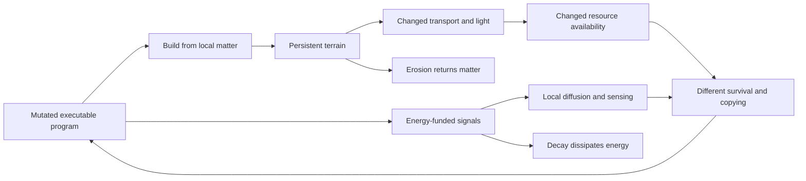

# Environmental coevolution (Stage 11)

Executable particles can now build persistent local terrain from existing matter and emit energy-funded signals. Terrain can alter resource transport and the incoming energy gradient; signals and terrain are observable through `SENSE`. The seed program is unchanged. New actions must arise through ordinary mutation.

The physical mechanisms, recording, matched intervention harness, and field inspector are implemented. The [first experiment](../experiments/environment/REPORT.md) found maintained structures and a causal effect on subsequent population dynamics. It did **not** demonstrate a new ecological niche or a reproducing engineering lineage.

## Run

```powershell
go run ./cmd/sim -width 32 -height 32 -seed 1 -ecology -matter-diffusion 4 -chemical-diffusion 4 -copy-model evolving -environment coupled -ticks 100000 -every 1000 -metrics data/environment.jsonl -save data/environment.json
go run ./cmd/summarize -input data/environment.jsonl -window 10000 -format json

./scripts/experiments.ps1 -OutputDirectory data/environment -Ticks 100000 -Every 1000 -Workers 16 -Seeds (1..8) -Cases environment,environment-inert,environment-no-mutation
```

`-environment` requires ecology. It is independent of `-copy-model`; the batch cases use evolving copying. Omitting the environment flag preserves the prior VM repertoire, random draws, and snapshot semantics.

| Mode | Meaning |
|---|---|
| `coupled` | Enable construction, signal emission, environmental sensing, and terrain attenuation of light and matter/chemical transport |
| `inert` | Keep the same actions, costs, stored fields, erosion, signals, and sensors; disable only terrain attenuation of light and transport |
| Omitted | No engineering fields or new instruction mutations |

The inert treatment still consumes matter for construction and energy for emission. It is a control for two specific terrain effects, not a removal of every environmental interaction. The zero-mutation batch retains the unchanged generalist seed and produces no engineered fields.

## Local actions

`BUILD` and `EMIT` extend the ecology VM from 17 to 19 instructions only when engineering is enabled. Both legacy copying and evolving copying draw new instruction mutations from the applicable repertoire. Genomes remain ordinary bounded programs.

| Instruction | Operation | Instruction energy cost |
|---|---|---:|
| `BUILD A B`, B > 0 | Move up to B matter units from the actor's cell into terrain at the selected cell, bounded by available matter and terrain capacity 8 | 4 |
| `BUILD A B`, B < 0 | Reclaim up to −B terrain units into free matter at the actor's cell | 4 |
| `EMIT A B` | Move up to B energy units from the actor into a signal field, bounded by signal capacity 64 and retaining at least one actor energy unit | 2, plus transferred signal energy |

For both instructions, A < 0 selects the actor's cell; otherwise A modulo 4 selects the adjacent north/east/south/west cell. Zero or blocked amounts still pay the instruction cost. Negative emission amounts do nothing. Terrain is cell state, not an organism or a bond; it remains after its builder moves or dies.

Engineering adds these `SENSE A B` channels. The observed value is written to memory slot B modulo 8; evaluation reads the tick-start state, as with existing sensors.

| A | Channel |
|---|---|
| 6 | Current-cell terrain |
| 7 | Current-cell signal |
| 8–11 | Adjacent terrain, north/east/south/west |
| 12–15 | Adjacent signals, north/east/south/west |

Existing channels 0–5 keep their meanings. When engineering is disabled, the previous behavior of all operands is preserved. Reading a signal is not itself evidence of communication or a useful response.

## Physical feedback and conservation

At the start of a step, using the pre-step tick counter:

- Every 64 ticks, one terrain unit per nonempty cell erodes back into free matter in that cell.
- Every eight ticks, one signal energy unit per nonempty cell dissipates as heat.
- Every four ticks, alternating neighbor pairs exchange one quarter of their signal difference, rounded toward zero. This transport is conservative and consumes no RNG draws.

Then external inflow, existing matter/chemical transport, and chemical charging run. In coupled mode, the incoming rate is divided by `1 + local terrain`, rounded down. Matter and chemical mixing amounts are divided by `1 + max(terrain at the two endpoints)`. Thus construction can alter local chemical availability and the energy landscape without introducing free matter or energy.



Stored terrain contributes to total matter; signal energy contributes to total energy and observer energy pools. Cumulative construction minus reclamation and erosion must equal the terrain field. Emission minus decay must equal signal energy. Per-genome action totals reconcile with the global engineering ledger. The ledger never controls selection or instruction execution.

`blocked_light` counts additional inflow that would fit in the same cell at that moment without its terrain attenuation. `attenuated_transfer` counts the reduction in each immediate mixing operation. These are local accounting comparisons; they are not the difference between two complete alternative histories.

## Matched causal intervention

Use the new command to compare both terrain feedback settings from each selected frozen snapshot:

```powershell
go run ./cmd/env-assay -input data/environment -case environment -out data/environment-assay -ticks 10000 -every 1000 -workers 16
```

Each pair starts with identical particles, terrain, signals, chemistry, memory, inherited policies, RNG state, and historical counters. Only the coupled/inert configuration switch differs. The source remains unchanged. New snapshots, JSONL, a completion manifest, and `results.json` retain source, initial, and final hashes. The output directory must be new; source hashes and metadata are verified before dispatch.

A difference after this intervention establishes a causal effect of the feedback switch on this continuation. It does not show that a builder benefits, that construction is adaptive, or that a new niche exists. Random histories can diverge after the initial physical effect. The no-active-construction controls and per-genome production counts help interpret that distinction. The test suite verifies identical results with one and 16 workers.

## Evidence and offline interface

JSONL stores sparse terrain/signal fields, cumulative global counters, and per-genome engineering actions. Window summaries validate conservation and monotonic records, report action deltas, and retain the final sampled field. A signal can be emitted and decay entirely between reporting frames; a blank final map does not mean no signaling occurred.

```powershell
go run ./cmd/council tree init -input data/environment -out data/environment-tree -window 10000
go run ./cmd/council tree archive -tree data/environment-tree
go run ./cmd/council tree export -tree data/environment-tree
```

In `index.html`, select **Inspect evidence**. The environment inspector offers world selection, terrain/signal layers, fixed-scale field maps, cell coordinates, activity totals, and an actor table with exact produced-copy counts for the same window. Colored cells support mouse and keyboard inspection. The page works offline and on narrow screens. Council facts reference engineering totals, and archive comparison contexts include the environment configuration.

## Compatibility and remaining criteria

Engineering uses snapshot **format 5**, with or without DSL state or evolving copying. Formats 2–4 keep their prior meanings and hashes. Snapshot loading cannot override the environment; use `env-assay` for an explicit recorded intervention.

This stage is currently **Go-only**. Both Warp input paths reject engineering worlds. The original 17-opcode Warp suite remains valid. The existing isolated-genome assay defines its own older standard ecology; use the matched environmental assay when retaining engineered source fields matters.

There are no niche labels, organisms, colony objects, or fitness rewards in these mechanisms. The next biological criteria are reproducing engineering lineages, repeatable differential benefits, and evidence that engineered conditions support a distinct adaptation. Stage 12's proto-multicellularity remains a separate research direction.
