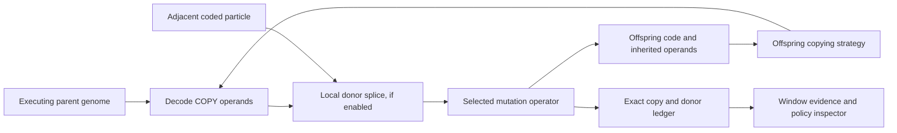

# Evolution of evolvability (Stage 10)

Genomes can now encode how they copy code and memory. The executing `COPY` and `COPYMEM` operands select mutation rates, mutation operators, recombination, a proofreading cost/rate tradeoff, and a memory inheritance format. These operands are ordinary program bytes: copying, mutation, and recombination can transmit or change them.

The mechanism is implemented and tested. The first experiment observed several executed policies and a spontaneous recombination event. **Persistent coexistence of different copying strategies has not been demonstrated.** See the [experiment report](../experiments/evolvability/REPORT.md).

## Run and compare

```powershell
go run ./cmd/sim -width 32 -height 32 -seed 1 -ecology -matter-diffusion 4 -chemical-diffusion 4 -copy-model evolving -ticks 100000 -every 1000 -metrics data/evolving.jsonl -save data/evolving.json
go run ./cmd/summarize -input data/evolving.jsonl -window 10000
go run ./cmd/summarize -input data/evolving.jsonl -window 10000 -format json

./scripts/experiments.ps1 -OutputDirectory data/evolvability -Ticks 100000 -Every 1000 -Workers 16 -Seeds (1..8) -Cases evolvability,evolvability-fixed,evolvability-no-mutation
```

The three batch cases share the 32×32 ecology, diffusion intervals, seed program, and seed list. Each worker owns one world; batch workers use `GOMAXPROCS=1`.

| Copy model | Behavior |
|---|---|
| Omitted / empty | Original five mutation operators and original operand-independent copying; legacy replay is preserved |
| `fixed` | New six-operator repertoire, base mutation rate, no recombination or proofreading, full working-memory inheritance; operands do not change these settings |
| `evolving` | Same six-operator repertoire, with policies decoded from executed instruction operands |

The fixed case is the control for policy evolution. Comparing it with evolving copying avoids conflating the new operand-edit operator with heritable regulation. `evolvability-no-mutation` uses evolving copying with a zero base rate. All decoded rates and recombination probabilities then remain zero.

## Encoding

Both instructions decode `A modulo 8` using nonnegative modular indexing. Rates use integer arithmetic, starting from `-mutation-ppm` (default 10,000 = 1%).

| A modulo 8 | Effective mutation rate before proofreading |
|---:|---|
| 0 | Base |
| 1 | Zero |
| 2 | Base / 4 |
| 3 | Base / 2 |
| 4 | Base × 2 |
| 5 | Base × 4 |
| 6 | Base × 8 |
| 7 | Base × 16 |

Multiplication is capped at 1,000,000 ppm. Division rounds down. Negative operands are supported; for example, `-1 modulo 8` is 7.

`COPY.B` uses these fields:

| Field | Meaning |
|---|---|
| Low three bits = 0 or 7 | Uniformly choose one of six mutation operators |
| Low three bits = 1 | Replace an instruction |
| Low three bits = 2 | Insert an instruction |
| Low three bits = 3 | Delete an instruction |
| Low three bits = 4 | Duplicate a segment of up to four instructions |
| Low three bits = 5 | Delete a segment of up to four instructions |
| Low three bits = 6 | Change one operand while preserving its opcode |
| Bit 3 set | Enable local recombination |
| Bit 4 set | Enable proofreading: divide the effective rate by four and charge two extra energy units per attempted `COPY` |

There is at most one mutation edit per successful copy. Program lengths stay between 1 and `max_code`; edits blocked by a length bound can have no effect. An operand edit samples A from −1…63 or B from −1…127. Replacement values, including ordinary `CONVERT` IDs, follow the existing instruction generator.

Recombination makes an independent chance check at the effective rate before mutation. On success, it scans four adjacent cells from a random direction for a coded donor other than the actor or target. A contiguous donor segment replaces part of the copied program without changing its length. No donor means no recombination. Neither input program is modified. Both a recombination and a mutation can occur during one copy.

`COPYMEM.B` uses the low two bits for layout: 0 = all eight slots, 1 = first four, 2 = even-indexed slots, 3 = no slots. Bit 2 chooses the actor's initial inherited memory instead of current working memory. Untransmitted slots become zero. At most one transmitted slot mutates; an empty layout consumes no mutation draw. `COPYMEM` still costs eight energy units.



This is a finite, predefined policy space. Genomes do not yet invent arbitrary mutation algorithms, memory sizes, or new VM instructions. The eight-cell memory representation stays fixed; inheritance format means which values are transmitted and from which source.

## Evidence and interface

Snapshots store cumulative `variation` records keyed by actor genome and decoded policy. Records contain successful copy counts, actual changed-data counts, recombination counts, donor-genome counts, and first/last execution ticks. Failed targets produce no record. Code totals reconcile with global copy accounting and per-genome copy history. The donor ledger supplements the existing primary-parent genealogy; it does not replace it with a full two-parent pedigree.

`changed` compares final offspring code with parent code, or copied memory with the parent's working memory. Memory layout/source changes can therefore count as changed data even without a random mutation. A sampled edit may leave data identical, and recombining identical code still counts as a recombination. These are different quantities.

JSONL frames contain copies of these records. Window summaries subtract cumulative counts, reject missing/regressing records, and count distinct **decoded policies**, rather than counting different genome hashes as different strategies. A persistent genome/policy must have at least five live individuals at every sampled frame and execute at least one successful copy in every reporting interval. This is a sampling-dependent persistence proxy, not continuous observation or adaptive-value proof.

Use the existing branch harness to preserve and inspect these worlds:

```powershell
go run ./cmd/council tree init -input data/evolvability -out data/evolvability-tree -window 10000
go run ./cmd/council tree grow -tree data/evolvability-tree -ticks 20000 -every 1000 -window 10000 -workers 16
go run ./cmd/council tree archive -tree data/evolvability-tree
go run ./cmd/council tree export -tree data/evolvability-tree
```

Open `index.html`, choose **Inspect evidence**, and expand **Inspect executed policies by genome**. Select a world and code/memory inheritance, or filter to persistent records. The page shows rates, operators, recombination/proofreading, counts, and population at the window end. Its controls work offline, including on narrow screens. Council dossiers also expose policy counts as referenceable facts.

## Compatibility

Encoded copying uses snapshot **format 4**, with or without DSL state. When combined with [Stage 11 environmental engineering](environment.md), format **5** also includes engineered fields and their ledger. The configuration and complete ledgers are part of the state hash. Formats 2 and 3 retain their existing semantics and serialization. A loaded world's copy model cannot be overridden; create a new experiment to change it.

The new model currently runs in **Go**. The Warp CLI bridge and Python batch API explicitly reject fixed/evolving copy models. Legacy Warp differential tests still pass. No GPU timing for encoded copying is claimed.

Tests cover encoding, bounded operators, ownership, memory layouts, local donor accounting, failed copies, proofreading costs, zero-rate controls, snapshot replay with/without DSL, invalid snapshots, telemetry reconciliation, persistence, and CLI continuation. The recorded experiment adds a real 16-worker tree continuation and browser checks.
