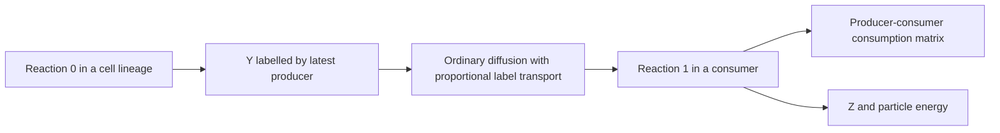

# Mobility controls and chemical contributions

The mechanisms suite separates bond-imposed immobility from other effects and measures local chemical contributions. It extends the [cell contribution assay](multicell-roles.md) with protocol version 2; the original `roles` suite remains version 1.

```powershell
go run ./cmd/role-assay -suite mechanisms -input data/multicell-mixed-witnesses -out data/my-mechanisms -workers 16 -ticks 5000 -every 100
python experiments/multicell-mechanisms/analyze.py --input data/my-mechanisms
```

Protocol 2 requires baseline ecology with no DSL rule state. A different reaction network could create or consume Y through additional paths; silently applying this tracer to it would invalidate provenance accounting. Witness validation, COPY-based lineage targeting, ordinary control replay and released-snapshot semantics follow the original assay. All interventions remain external to snapshots and must be replayed from their source witnesses.

## Mobility experiment

| | Ordinary MOVE | MOVE effects suppressed for all tagged cells |
|---|---|---|
| Internal bonds retained | `intact` | `anchored` |
| Internal bonds removed and subsequent internal BIND suppressed | `no-bonds` | `no-bonds-anchored` |

Anchoring applies to original selected cells and their actual-COPY descendants, including descendants that are not bonded. It is an explicit intervention, not a claim that baseline bonds would have immobilized all these cells. Outsiders retain normal behavior. Ordinary MOVE instruction cost and instruction-pointer advancement still occur; the movement effect and its RNG draws are suppressed.

The anchored pair holds the movement restriction constant. Its strongest comparison is a full physical-state projection which removes **only** the relation graph and genome BIND counters. Both RNGs, all cell contents, particles, ancestry, programs, instruction counters and environmental state remain in the comparison. Full snapshot hashes are also retained; the projection does not pretend that the worlds have identical bond graphs.

## Reaction interventions

One arm per original cell lineage suppresses CONVERT reaction 0 (`no-reaction0`), and another suppresses reaction 1 (`no-reaction1`). Other instructions and reactions remain available. The normal instruction cost is retained, while the disabled reaction's chemical transformation and released energy do not occur.

These arms perturb local metabolism. They also change chemical availability, survival, movement, copying and later RNG consumption. Partner-survival differences over an entire continuation do not isolate useful specialization. A synthetic complementary producer/consumer fixture provides a positive control; evolved witnesses must supply their own evidence.

## Proportional Y tracer

Baseline reactions are `X -> Y + 4 energy` and `Y -> Z + 4 energy`. Every source grid cell starts with an accounting vector for its Y:

- an unknown-provenance initial pool;
- Y produced after the start by untagged cells;
- one category for each original selected cell's COPY lineage.

Successful reaction 0 adds Y to its producer's category. During conservative transport, the observed integer transfer carries the same fraction of every source category. Reaction 1 consumes categories in proportion to their current amounts. The consumption matrix records producer category and consumer lineage, with a separate outside-consumer column. After Y is consumed, its label ends; recycling Z and later making Y attributes that new Y to its latest producer.



This is a **well-mixed provenance convention**, not tracking of individual molecules. Chemical units in the physical world have no origin labels, and fractional provenance is held only in the observer. It uses no random numbers and does not alter physical concentrations or energy. Consumption from another lineage is material coupling under this convention; it is not sufficient evidence of a specialized helper, obligatory dependence or selection at group level. A producer and consumer can cease belonging to the same connected group after the initial witness.

The tracer records total reaction units by original-cell lineage and separately for each original cell. An acquired-energy identity checks that baseline conversion released four units per reaction unit. Every endpoint checks each cell's labelled Y against physical Y and each producer's initial-plus-produced mass against consumed-plus-remaining mass. Global identities also agree with physical CONVERT counters. Exact intermediate event replay remains a Go responsibility; the Python audit checks artifacts and balances.

## Next mechanism experiment

The [first results](../experiments/multicell-mechanisms/REPORT.md) motivate a hypothesis to test: both chemical reactions are currently cheap to alternate within one generalist program, so access to neighboring products may offer little reason to specialize.

A next experimental branch can introduce a resource-funded cost for switching between reaction types, with zero-cost controls and several nonzero costs. The mechanism would apply uniformly to all cells, without assigning producer/consumer roles or rewards for group size. Its state, costs, inheritance/reset semantics and snapshots must be explicit before running evolutionary comparisons. Success would require persistent differences in executed reaction profiles, useful contributions to other lineages, and eventually transmission of that organization across daughter groups. Merely obtaining larger immobile clusters or fewer metabolic reactions would not meet the criterion. This mechanism is a proposal, not part of the current solver.
