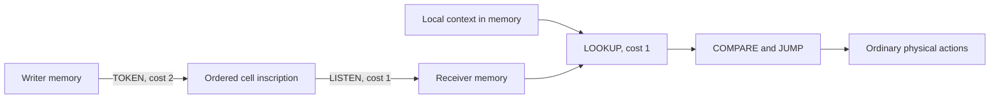

# Symbolic primitives and reception experiments

Stage 15 adds opt-in mechanisms for short inscriptions and memory-based interpretation. It does not assign meanings, rewards, sender/receiver roles, or a symbolic language. The ordinary ecology seed is unchanged. Mutations can discover three additional instructions.

```powershell
go run ./cmd/sim -width 32 -height 32 -ecology -matter-diffusion 4 -chemical-diffusion 4 -copy-model evolving -environment coupled -symbols persistent -ticks 100000 -every 1000 -metrics data/symbols.jsonl -save data/symbols.json
```

## Mechanics

| Opcode | Operands | Effect | Energy cost |
|---|---|---|---:|
| `TOKEN` (19) | A: direction; B: memory register | Append `memory[B mod 8] mod 4` to the target inscription | 2 |
| `LISTEN` (20) | A: direction; B: output register | Read the inscription into `memory[B mod 8]` | 1 |
| `LOOKUP` (21) | A: input register; B: context/output register | Read `memory[(memory[A] mod 8 + memory[B] mod 8) mod 8]` into B | 1 |

Indices use nonnegative modulo. Negative directions address the current cell; other directions wrap through N/E/S/W. An inscription retains the latest **two ordered tokens** from a four-token alphabet. A write refreshes its lifetime to **64 ticks**. Reading does not refresh it. Expired inscriptions are removed at the next inflow. At a saved tick boundary an inscription with `expires == tick` is already unreadable. A newly written inscription is first visible to another instruction on the following tick because all reads use the tick-start view.

Empty reads return 0. Single tokens `a` encode as `1+a`; pairs `[a,b]` encode as `5+4*a+b`. Thus all 20 nonempty words have distinct encodings. Token identity and order are physical encodings, with no prescribed behavioral meaning. LOOKUP intentionally maps into eight memory cells, so distinct words can share a table entry. COMPARE and JUMP provide additional interpretation through ordinary program flow.

The output register's previous value supplies the lookup context. The same received word can therefore select different memory entries in different contexts. Both operands are reduced before addition to avoid integer overflow. The existing WRITE, READ and COPYMEM instructions initialize, modify and transmit these tables; there is no new hidden memory store.



Writes dissipate their cost immediately. Inscriptions are bounded informational cell state, like particle memory; they are not an extra energy or matter reservoir. They do not diffuse, shade light, move matter, or replace Stage 11 scalar signals. Token-author IDs are provenance visible to observation only. A foreign read means at least one token was written by a different particle, which may since have died.

## Reception controls

- `persistent`: stable token identities.
- `scrambled`: before decoding, shift every token by a deterministic tick-dependent value modulo four. Length, order and within-tick token equality are preserved. The shift uses SplitMix64 arithmetic on the tick without consuming either world RNG. This challenges stable identity mappings; it is not information-theoretic destruction of all communication.
- `unreadable`: LISTEN returns zero, with the same instruction cost. Physical writes and their costs remain enabled.

Controls act on reception only. They do not disable local LOOKUP computations. Their effect can change later actions, reproduction and resources. A hand-written test demonstrates this causal path; that fixture is never seeded into the evolutionary experiments.

```powershell
./scripts/experiments.ps1 -Workers 16 -Seeds (1..8) -Cases symbols,symbols-scrambled,symbols-unreadable,symbols-no-mutation -Ticks 100000 -Every 1000 -OutputDirectory data/my-symbols
go run ./cmd/symbol-assay -input data/my-symbols -out data/my-symbol-assay -workers 16 -ticks 20000 -every 1000
go run ./cmd/summarize -input data/my-symbols -window 20000 -format json
go run ./cmd/council prepare -input data/my-symbol-assay -out data/my-symbol-round -window 20000
```

The assay requires a completed source batch, checks snapshot hashes, and forks each `symbols` case into all three reception modes. It preserves particles, words, memory, both RNGs and cumulative ledgers at the branch point. Results record source, initial and final hashes, snapshots and full telemetry. Each output directory must be new. UI work is deferred.

## Evidence and interpretation

Global and per-genome counters distinguish writes, reads, nonempty reads, pair reads, foreign reads, lookups, and lookups with a nonzero context offset. Window summaries report differences, validate monotonic counters and actor totals, and expose these observations to the council protocol. `context_lookups` counts an executed operation with a nonzero offset; it does **not** establish meaningful context use, learning, or semantic interpretation. Reading a two-token word likewise does not establish compositional semantics.

The [recorded experiment](../experiments/symbols/REPORT.md) separates primitive reachability from an evolved beneficial convention. Useful follow-up evidence would include reproducible behavioral changes under token remapping, task-dependent benefits that transfer to held-out environments, and preservation of those benefits across copying. Symbol counts, bonds and higher-level individuality are not mandatory progress criteria. The central research goals are sustained evolution, functional diversity and increasing adaptive capability, including in individual particles.

Snapshot format **7** contains the optional symbols configuration, cell inscriptions and symbol ledger. Formats 2–6 and their mutation repertoires remain unchanged. A symbol snapshot cannot be relabeled as an older format. Warp explicitly rejects symbol worlds; they run in Go.
